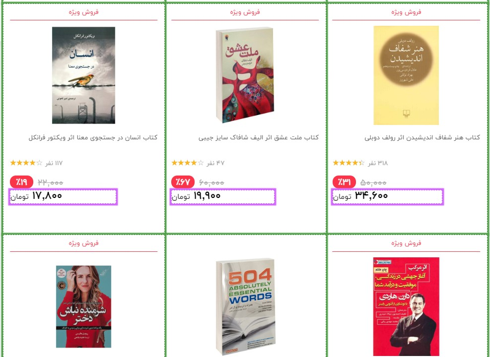
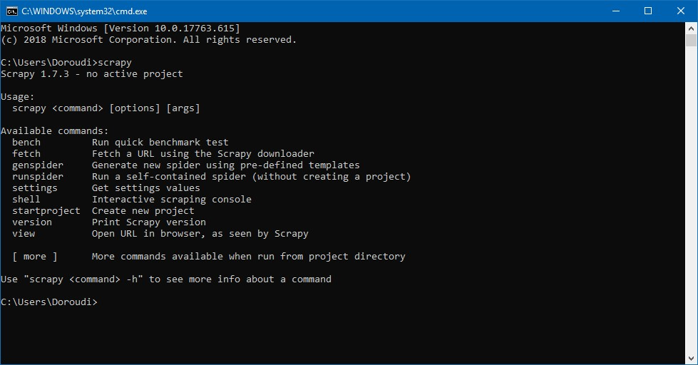
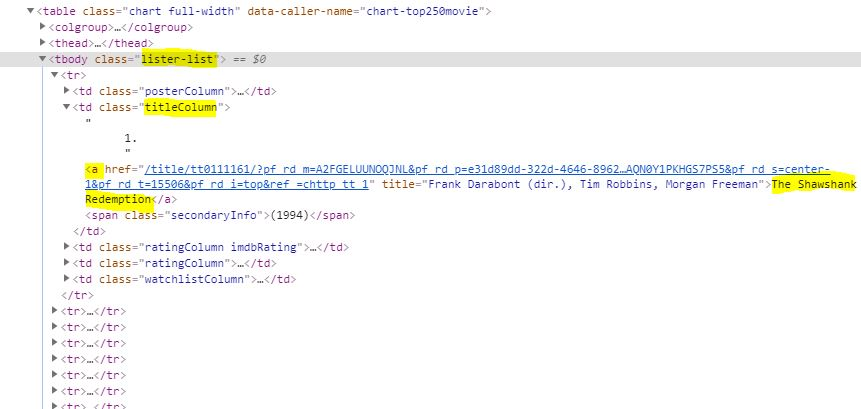
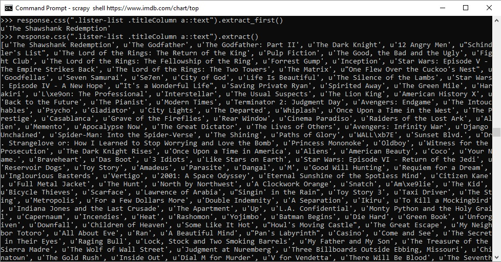
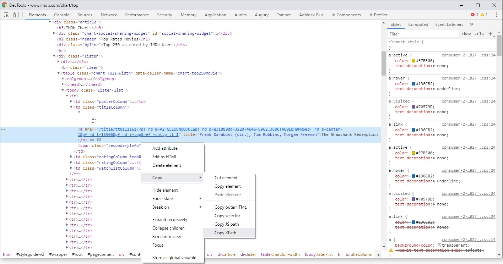
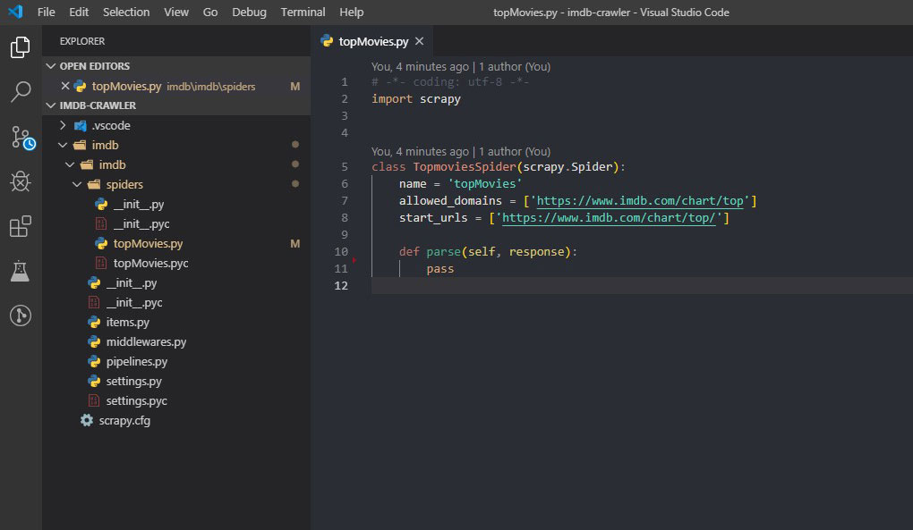
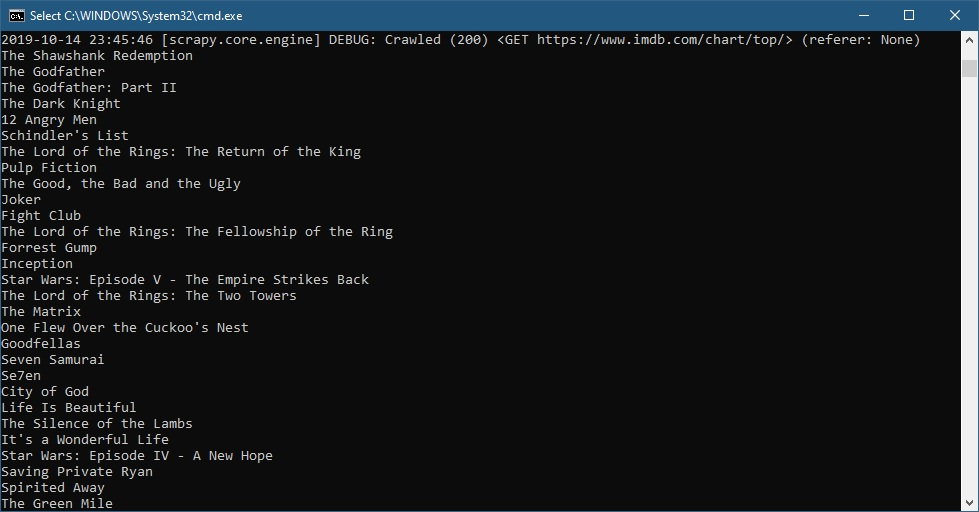
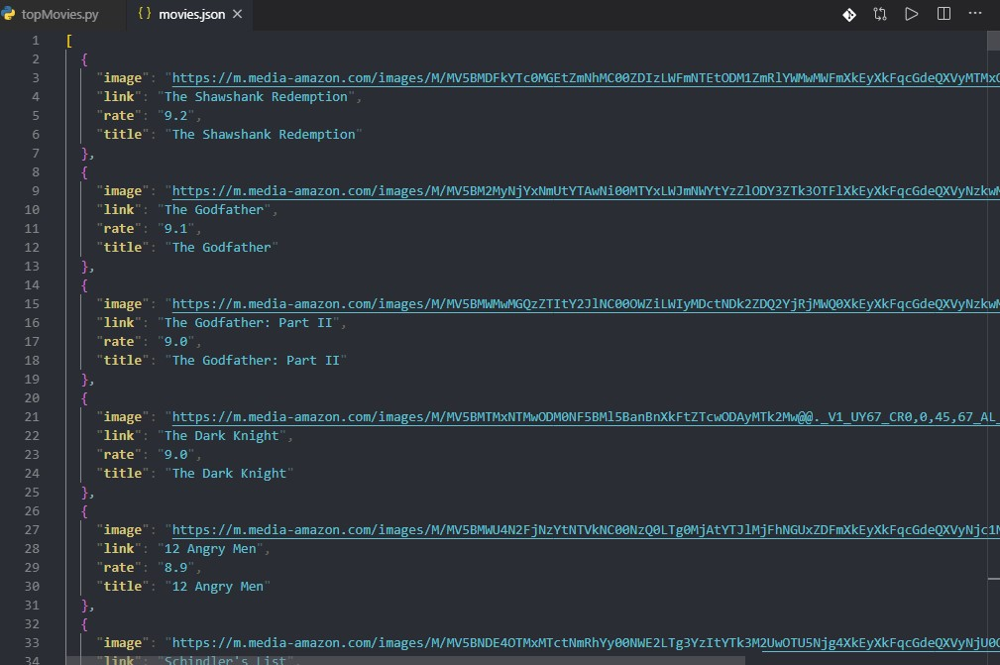

> نکته:
> این یادداشت را پیشتر در ویرگول [منتشر کرده بودم](https://virgool.io/@doroudi/%D8%B3%D8%A7%D8%AE%D8%AA-%D8%AE%D8%B2%D9%86%D8%AF%D9%87-%D9%88%D8%A8-%D8%A8%D8%A7-scrapy-q3i67sbemtm5) و با کمی اصلاح اینجا منتشر می شود

اخیرا برای پروژه ای نیاز به استخراج داده از سایت IMDB داشتم ، البته خود سایت IMDB بخشی از اطلاعات فیلم ها رو بصورت فایل CSV در اختیارتون قرار میده ولی این اطلاعات چندان کامل نبود و مجبور شدم برای این کار یک خزنده وب با Scrapy ایجاد کنم در این یادداشت سعی میکنم فرایند توسعه این خزنده و البته نحوه استفاده از scrapy برای این منظور را توضیح بدهم.

## خزنده وب چیست؟ 

خزنده وب یا Web Crawler ابزاری است که فرایند دریافت داده های موجود در صفحات وب را خودکار می کند، برای مثال دوست دارید لیست قیمت محصولات دیجیکالا را بصورت روزانه دریافت کنید و تغییرات را مقایسه کنید ، دیجیکالا هیچ API ای برای دسترسی به اطلاعات محصولاتش دراختیار عموم قرار نمیده ، پس یا باید به صورت دستی قیمت ها رو کپی کنیم 🙃 یا ابزاری داشته باشیم که این کار به صورت خودکار انجام بده ، خزنده های وب دقیقا برای این منظور ساخته شده اند. خزنده وب محتوای وبسایت را دانلود می کند و بخش هایی از سایت که محتوای مورد نظر ما اونجا قرار دارد رو استخراج میکند.



## اسکرپی چیست؟


ابزارهای مختلفی برای داده کاوی در وب وجود داره ، یکی از راحت ترین اون ها پلاگین Data Scraper برای مرورگر کروم هست (البته پلن پولی داره) ، ولی اگر کمی برنامه نویسی بلد باشید ساخت یک خزنده وب با Scrapy اصلا کار سختی نیست ، در واقع Scrapy یک فریم ورک مبتنی بر پایتون برای ساخت خزنده های وب است. Scrapy فرایند ساخت ، اجرا و ذخیره خروجی خرنده وب رو پوشش میده.

### گام اول: نصب Scrapy

اگر قبلا روی سیستم تان پایتون نصب کرده اید می توانید با استفاده از pip اقدام به نصب Scrapy کنید

```bash
pip install Scrapy
```

بر خلاف اون چیزی که انتظار داشتم نصب Scrapy حداقل در ویندوز و با نسخه 3.6 پایتون کمی به مشکل بر میخوره ولی با نسخه 2.7 پایتون همه چیز خوب پیش رفت ، ولی نتیجه تجربه ای که در نصب scrapy در ویندوز داشتم اینه که بهترین راه برای نصب Scrapy حداقل در ویندوز  استفاده از Anaconda و البته نسخه کم حجم اون یعنی MiniConda است ، نیازی به نصب مفسر Python نیست و همه چیز همراه آناکوندا نصب میشه.
بعد از دانلود و نصب Miniconda نوبت به نصب Scrapy میرسه ، کافیه در خط فرمان دستور زیر رو برای نصب Scrapy اجرا کنید

```bash
conda install -c conda-forge scrapy
```

پس از پایان نصب می‌توانید از طریق دستور scrapy از موفق بودن نصب اون اطمینان حاصل کنید



### تست Scrapy

پیش از اینکه درگیر کدنویسی بشوید، می‌توانید با استفاده از شل scrapy از امکانات اون بصورت تعاملی استفاده کنید ، کار بسیار ساده است و کافیه با استفاده از دستور زیر وارد shell بشوید:

```bash
scrapy shell <website_url>
```

بعد از اجرای این دستور صفحه وب دانلود میشه و وارد محیط shell می شوید و می توانید با استفاده از انتخابگر های موجود به المان های موجود در صفحه دسترسی داشته باشید:
برای مثال انتخاب عناوین 250 فیلم برتر در imdb:

```bash
scrapy shell https://www.imdb.com/chart/top
```

با استفاده از آبجکت response می توان به محتوای صفحه دانلود شده دسترسی داشت ، برای مثال برای مشاهده کد html صفحه دانلود شده می‌توان از response.body استفاده کرد.
برای انتخاب المان های مشخص scrapy دو راه حل قدرتمند در اختیارتان قرار میدهد :

* انتخابگر CSS
* انتخابگر xpath

اگر با html و css آشنایی داشته باشید استفاده از انتخابگر css برایتان بسیار ساده خواهد بود ، برای مثال انتخاب عناوین فیلم های موجود در IMDB می تواند با انتخابگر زیر انجام شود:

```css
.lister-list .titleColumn a
```



```python
response.css(".lister-list .titleColumn a::text").extract()
```



تبریک میگم ، به همین سادگی لیست فیلم های برتر موجود در وب سایت imdb رو استخراج کردیم.
همانطور که مشخص است ، برای دریافت متن المان میتوان از text:: استفاده کرد و برای استخراج باید متد extract را بعد از انتخابگر css تان بنویسید. برای انتخاب المان نخست می‌توانید از extract_first استفاده کنید.
انتخابگر xpath روشی دیگر برای انتخاب عناصر موجود در صفحه وب مبتنی بر xml است و می‌توانید با استفاده از ابزار Developer Tool موجود در مرورگرتان آدرس xpath مربوط به المان انتخابی تان را دریافت کنید



برای مثال انتخابگر عنوان فیلم ها با xpath به شکل زیر است:

```python
response.xpath("/html/body/div[1]/div/div[2]/div[3]/div/div[1]/div/span/div/div/div[3]/table/tbody/tr[1]/td[2]/a/text()").extract()
```

[اطلاعات بیشتر درباره xpath](https://docs.scrapy.org/en/xpath-tutorial/topics/xpath-tutorial.html)

### ایجاد پروژه

فکر میکنم تا اینجا توضیح کافیه ، بیاید اولین پروژه مان را ایجاد کنیم ، هرچند که می توانید یک پروژه ساده با پایتون ایجاد کنید و با import کردم scrapy از امکانات scrapy در آن استفاده کنید ولی پیشنهاد میکنم از دستور startproject برای ایجاد پروژه استفاده کنید:

```bash
scrapy startproject <project_name>
```

اولین پروژه مان را با نام imdb ایجاد کردیم ، یک پوشه با نام پروژه تان به همراه چندین فایل برایتان ایجاد شد ، گام بعدی ایجاد اولین spider مان است ، هر پروژه scrapy می تواند شامل چندین اسپایدر باشد که هر کدام می تواند مسئول دریافت داده های بخش های متفاوت از یک وبسایت باشند.
برای ایجاد اولین spider کافیست بعد از ورود به پوشه پروژه دستور زیر را اجرا کنید:

```bash
cd imdb
scrapy genspider topMovies https://www.imdb.com/chart/top
```

داخل پوشه spiders یک فایل پایتون جدید با نام topMovies اضافه شده است ، فعلا فقط با این فایل کار خواهیم کرد ، پیشنهاد من بری ویرایش این فایل استفاده از [Visual Studio Code](https://code.visualstudio.com/) و یا ویرایشگر مخصوص پایتون [PyCharms](https://www.jetbrains.com/pycharm/) هست (گزینه دوم غیر رایگان هست).



همانطور که مشاهده می کنید ، هر اسپایدر در واقع یک کلاس پایتون است که از scrapy.Spider ارث بری دارد.
مقدار allowed_domains و start_urls به ترتیب دامنه هایی که خزنده مجاز به پیمایش هست و آدرس های آغازین هست که هر کدام میتواند چندین مقدار داشته باشند و به صورت پیش فرض آدرسی است که هنگام ایجاد اسپایدر وارد کرده بودیم.
متد اصلی parse هست و بعد از دانلود هر یک از url های موجود در start_urls اجرا خواهد شد، همانطور که مشخص هست یکی از پارامتر های این متد response هست و همان response ای است که در shell به آن دسترسی داشتیم و میتوانیم از طریق آن و استفاده از انتخابگر ها به محتوای مورد نظرمان دست یابیم.

### دریافت لیست فیلم ها

میتوانیم از همان انتخابگری که در محیط شل برای دریافت لیست فیلم ها استفاده کرده بودیم در درون کدمان استفاده کنیم (فعلا از دستور print برای نمایش خروجی استفاده کردیم)

```python

import scrapy
import json
from ..items import MovieItem

class TopmoviesSpider(scrapy.Spider):
    name = 'topMovies'
    allowed_domains = ['imdb.com']
    start_urls = ['https://www.imdb.com/chart/top/']

    def parse(self, response):
        links = response.css(".lister-list tr a::attr(href)").extract()
        for link in links:
            link = response.urljoin(link)
            print(link)
            yield scrapy.Request(url=link, callback=self.parse_details)

    def parse_details(self, response):
        json_res = json.loads(response.xpath(
            "//script[@type='application/ld+json']/text()").extract_first())
        film = MovieItem()
        if 'name' in json_res:
            film['name'] = json_res['name']
        if 'image' in json_res:
            film['image'] = json_res['image']
        if 'genre' in json_res:
            film['genre'] = json_res['genre']
        if 'contentRating' in json_res:
            film['contentRating'] = json_res['contentRating']
        if 'actor' in json_res:
            film['actor'] = json_res['actor']
        if 'creator' in json_res:
            film['creator'] = json_res['creator']
        if 'description' in json_res:
            film['description'] = json_res['description']
        if 'keywords' in json_res:
            film['keywords'] = json_res['keywords']
        if 'aggregateRating' in json_res:
            film['aggregateRating'] = json_res['aggregateRating']
        if 'review' in json_res:
            film['review'] = json_res['review']
        if 'trailer' in json_res:
            film['trailer'] = json_res['trailer']
        if 'duration' in json_res:
            film['duration'] = json_res['duration']

        yield film
```

میتوانید خزنده ایجاد شده را با استفاده از دستور زیر اجرا کنید:

```bash
scrapy crawl topMovies
```

خروجی



بهتر است به جای استفاده از print برای نمایش خروجی نتیجه دلخواه را به عنوان مقدار برگشتی متد parse برگردانیم ، برای مثال در کد زیر به جز عنوان ، تصویر ، لینک و امتیاز فیلم ها رو هم دریافت کردیم ، نکته جدید استفاده از

```css
::attr(src)
```

برای دریافت مشخصه src تگ img است.

```python

import scrapy
class TopmoviesSpider(scrapy.Spider):
    name = 'topMovies'
    allowed_domains = ['imdb.com']
    start_urls = ['https://www.imdb.com/chart/top/']

    def parse(self, response):
        movies = response.css(".lister-list tr")
        for movie in movies:
            yield {
                'image': movie.css('.posterColumn img::attr(src)').extract_first(),
                'title': movie.css('.titleColumn a::text').extract_first(),
                'link': movie.css('.titleColumn a::text').extract_first(),
                'rate': movie.css('.ratingColumn strong::text').extract_first()
            }
            pass
```

برای ذخیره خروجی تولید شده توسط خزنده تان میتوانید از نام فایل به همراه پارامتر o در دستور اجرای خزنده استفاده کنید:

```bash
scrapy crawl topMovies -o movies.json
```

خروجی



پسوند فایل هایی که توسط scrapy پشتیبانی می شوند عبارتند از :

* JSON
* JSON lines
* CSV
* XML

### دریافت جزئیات فیلم

برای دریافت جزئیات فیلم ها نیاز هست که خزنده وارد لینک هر فیلم بشه و اطلاعات کامل هر فیلم رو از صفحه جزئیات بخونه ، کدمان رو به گونه ای تغییر میدیم که به فقط لیست لینک ها رو از صفحه اصلی بخونه و سایر فیلد ها رو از صفحه جزئیات.
برای دریافت صفحه جدید و اجرای متد parse روی اون نیاز داریم که از scrapy.Request استفاده کنیم ، که پارامتر دوم اون متدی است که بعد از دریافت باید عملیات parse رو انجام بده
چون url ها بصورت relative ثبت شده اند از response.urljoin برای تصحیح لینک استفاده کردیم:

```python
def parse(self, response):
    links = response.css(".lister-list tr a::attr(href)").extract()
    for link in links:
         link = response.urljoin(link)
         yield scrapy.Request(url=link, callback=self.parse_details)
def parse_details(self, response):
    #parse details
```

برای اینکه ساختار منسجم تری داشته باشیم میتوانیم کلاس مدل برای داده های برگشتی داشته باشیم ، فایل items در پروژه Scrapy برای این منظور در نظر گرفته شده و میتونید مدل رو توی این فایل تعریف کنید:

```python
class MovieItem(scrapy.Item):
    url = scrapy.Field()
    name = scrapy.Field()
    image = scrapy.Field()
    genre = scrapy.Field()
    contentRating = scrapy.Field()
    actor = scrapy.Field()
    creator = scrapy.Field()
    description = scrapy.Field()
    datePublished = scrapy.Field()
    keywords = scrapy.Field()
    aggregateRating = scrapy.Field()
    review = scrapy.Field()
    trailer = scrapy.Field()
    duration = scrapy.Field()
    pass
```

برای دریافت فیلد ها میتوانید از روش قبلی (استفاده از انتخابگر css) استفاده کنید ولی اگر کمی در کد صفحه جزئیات فیلم در imdb دقت کنید متوجه خواهید شد که این توی این صفحه جزئیات کامل فیلم توی یک تگ اسکریپت بصورت json داره و با کمتر زحمت میتونید اطلاعات رو از اونجا دریافت کنید:


برای دریافت محتوای اسکریپت میتونید به جای انتخابگر css از xpath استفاده کنید:

```python
response.xpath("//script[@type='application/ld+json']/text()").extract_first()
```

مقداری که بر میگرده بصورت رشته است و باید به json تبدیل بشه ، میتونید از json.loads استفاده کنید:

```python
json.loads(response.xpath("//script[@type='application/ld+json']/text()").extract_first())
```

کد نهایی

```python
import scrapy
import json
from ..items import MovieItem

class TopmoviesSpider(scrapy.Spider):
    name = 'topMovies'
    allowed_domains = ['imdb.com']
    start_urls = ['https://www.imdb.com/chart/top/']

    def parse(self, response):
        links = response.css(".lister-list tr a::attr(href)").extract()
        for link in links:
            link = response.urljoin(link)
            print(link)
            yield scrapy.Request(url=link, callback=self.parse_details)

    def parse_details(self, response):
        json_res = json.loads(response.xpath(
            "//script[@type='application/ld+json']/text()").extract_first())
        film = MovieItem()
        if 'name' in json_res:
            film['name'] = json_res['name']
        if 'image' in json_res:
            film['image'] = json_res['image']
        if 'genre' in json_res:
            film['genre'] = json_res['genre']
        if 'contentRating' in json_res:
            film['contentRating'] = json_res['contentRating']
        if 'actor' in json_res:
            film['actor'] = json_res['actor']
        if 'creator' in json_res:
            film['creator'] = json_res['creator']
        if 'description' in json_res:
            film['description'] = json_res['description']
        if 'keywords' in json_res:
            film['keywords'] = json_res['keywords']
        if 'aggregateRating' in json_res:
            film['aggregateRating'] = json_res['aggregateRating']
        if 'review' in json_res:
            film['review'] = json_res['review']
        if 'trailer' in json_res:
            film['trailer'] = json_res['trailer']
        if 'duration' in json_res:
            film['duration'] = json_res['duration']

        yield film
```

امیدوارم مطالبی که مطرح شد به دردتون بخوره ، البته مواردی هست که فرصت پرداختن بهشون در این مقاله پیش نیومد ، مثل صفحه بندی ، تنظیمات ، pipeline ها و ... که سایت scrapy مرجع کاملی برای یادگیری این موارد هست.
کد پروژه رو میتونید از گیت هاب [گیت هاب](https://github.com/doroudi/imdb-crawler) دریافت کنید.
