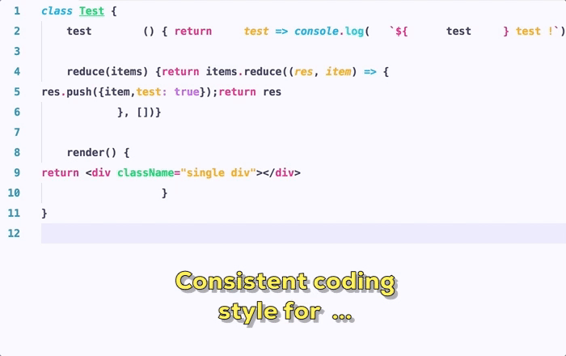
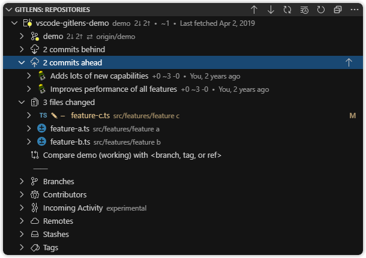
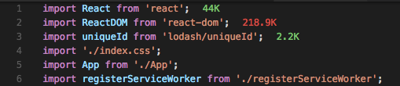

افزونه ها بخش جدایی ناپذیر از محیط های توسعه نرم افزار هستند و Visual Studio Code به عنوان محبوب ترین محیط توسعه نرم افزار در این روز ها دارای هزاران افزونه کاربردی در زمینه های مختلف است.

در این یادداشت افزونه هایی که بیشترین استفاده از آنها را در توسعه وب میبرم را معرفی میکنم .

### 1-TabNine

فارغ از زبان یا فریم ورکی که با اون کار میکنید قطعا TabNine کاربردی است که با استفاده از هوش مصنوعی Intellisense های بسیار مفیدی را ارئه می دهد و مطمئنا از دقت و پیشنهادات جالبی که ارائه میدهد شگفت زده خواهید شد. یک ابزار بسیار ، کاربردی که با یادگیری عمیق یک سطح جدید از Intellisense رو معرفی میکنه و مطمئنا به شدت ازش خوشتون خواهد آمد.

#### 2-Bracket Pair Colorizer

#### 3-Prettier

#### 4-GitLense

#### 5- Live server

#### 6- Path Intellisence

#### 7- Setting Sync

#### 8- WakaTime

#### 9- AutoImport

#### 10- Import Cost

#### 11- Debugger For Chrome

#### 12- Code Runner

#### 13- EsLint

#### 14- Dracula Theme

## 15- Git Graph

## 16- Peacock

## 17- Better Comments

## 18- CodeSnap

#### 20- FiraCode (Font)
